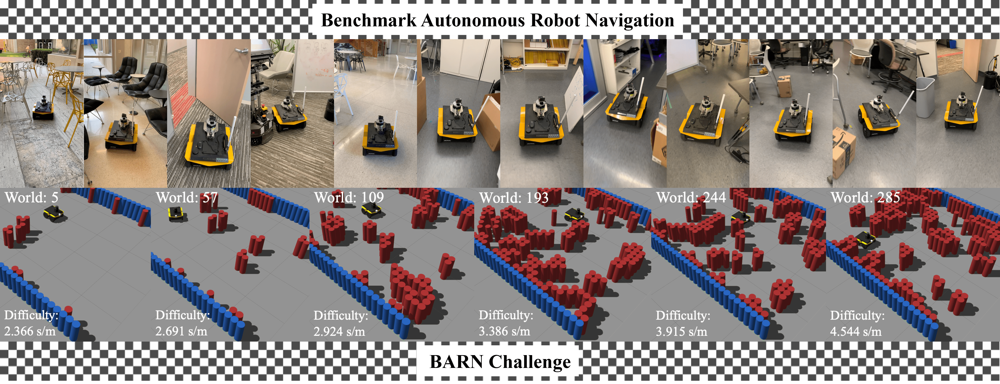

<p align="center">
  
  </p>


# BARN Navigation Challenge for 2025

## Language
This code is written in C++ and can be integrated with Python


## Requirements

If you are running the project on a local machine without containers, ensure the following dependencies are met:

* ROS version at least noetic
* CMake version at least 3.10
* Python version at least 3.8
* Python packages: defusedxml, rospkg, netifaces, numpy

The requirements above are just suggestions. If you run into any issue, please contact organizers for help (ylu22@gmu.edu).

## Installation

Follow the instructions below to run simulations on your local machines.

1. Download the requirment from jackal robot, if you run successfully, then go step 2 (https://www.clearpathrobotics.com/assets/guides/noetic/jackal/simulation.html)
```
sudo apt-get install ros-noetic-jackal-simulator ros-noetic-jackal-desktop ros-noetic-jackal-navigation
```

2. Install Python dependencies
```
pip3 install defusedxml rospkg netifaces numpy
```
3. Create ROS workspace
```
mkdir -p /<YOUR_HOME_DIR>/jackal_ws/src
cd /<YOUR_HOME_DIR>/jackal_ws/src
```
4. Clone this repo and required ros packages: (replace <YOUR_ROS_VERSION> with your own, e.g. noetic)
```
git clone https://github.com/jackal/jackal.git --branch <YOUR_ROS_VERSION>-devel
git clone https://github.com/jackal/jackal_simulator.git --branch <YOUR_ROS_VERSION>-devel
git clone https://github.com/jackal/jackal_desktop.git --branch <YOUR_ROS_VERSION>-devel
git clone https://github.com/jackal/jackal_robot.git -- branch <YOUR_ROS_VERSION>-devel
```

5. Please replace this with jackal/jackal_control/config/robot_localization.yaml, as these are some changes from the previous version. Otherwise, you will see the robot's localization deviate.

Replace line 13 to line 19:
```
imu0: /imu/data
imu0_config: [false, false, false,
              true, true, false,
              false, false, false,
              true, true, true,
              false, false, false]
```
to 
```
imu0: /imu/data
imu0_config: [false, false, false,
              true, true, true,
              false, false, false,
              true, true, true,
              false, false, false]
```


6. Clone this code from Yuanjie Lu:
```
git clone https://github.com/yuanjielu-64/BARN2025.git
```
7. Install ROS package dependencies: (replace <YOUR_ROS_VERSION> with your own, e.g. noetic)
```
cd ..
source /opt/ros/<YOUR_ROS_VERSION>/setup.bash

rosdep init; rosdep update
rosdep install -y --from-paths . --ignore-src --rosdistro=<YOUR_ROS_VERSION>
```

8. Cd the jackal_ws/ and build the workspace
```
catkin_make
source devel/setup.bash
```

## Run Simulations

### Note: 
Many parts of the code are designed for future projects, meaning some files are not actively used. Please follow the instructions below for testing and execution.

### File Structure Overview
* Data storage: barn_challenge_lu/launch/data/
* Launch files: barn_challenge_lu/launch/
* Move base configuration files: barn_challenge_lu/params/
* Core implementation: barn_challenge_lu/src/
* Test results: barn_challenge_lu/scripts/

1. Running a Single Test
```
cd scripts
python run_ddp.py --world_idx &i --out "out.txt"
```
Where &i is the world index you want to test.

2. Running All Tests
```
./test.sh
```

3. If you want to run with DWA, DDPDWAPlanner, LuPlanner and DDPLuPlanner, please change /launch/gazebo_launch_ddp.launch at line 44

Please note that MPPIPlanner and DDPMPPIPlanner represent LuPlanner and DDPLuPlanner respectively, not the MPPI algorithm

```
args="RunMP $(find barn_challenge_lu)/data/ParamsForJackalGlobal.txt UseMP DWAPlanner"/>
args="RunMP $(find barn_challenge_lu)/data/ParamsForJackalGlobal.txt UseMP DDPDWAPlanner"/>
args="RunMP $(find barn_challenge_lu)/data/ParamsForJackalGlobal.txt UseMP MPPIPlanner"/>
args="RunMP $(find barn_challenge_lu)/data/ParamsForJackalGlobal.txt UseMP DDPMPPIPlanner"/>
``

### Contribution
If you would like to contribute to this project, feel free to submit a pull request or open an issue on GitHub.

### License
This project is licensed under the MIT License. See the LICENSE file for details

### Contact
For any questions or support, please contact:
📧 Yuanjie Lu - ylu22@gmu.edu